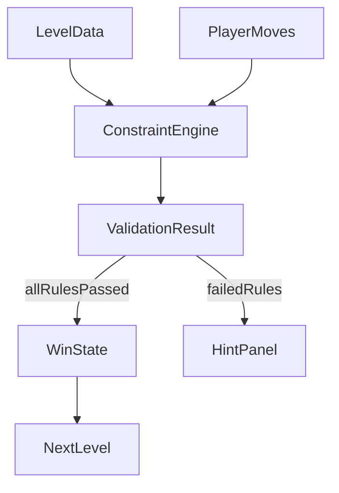

# خطة بناء لعبة Bus Seat Puzzle (6 مراحل)

## الهدف
إنشاء لعبة ويب ألغاز منطقية: لدينا مقاعد ثابتة داخل باص، وكل شخص لديه شروط جلوس (مثال: يحب الوسط، يكره الأطراف، يريد الشباك). اللاعب يضع كل شخص في المقعد المناسب، وإذا تحققت جميع الشروط يفوز وينتقل للمرحلة التالية.

## التقنية المقترحة (Default عملي وسريع)
- واجهة: React + TypeScript + Vite
- تنسيق: CSS بسيط أو Tailwind (اختياري)
- إدارة الحالة: `useState` (لا نحتاج Redux)
- بيانات المراحل: ملف JSON/TS ثابت داخل المشروع

## تصميم اللعبة (Architecture)

## نموذج البيانات الأساسي
- `Seat`: رقم المقعد + خصائصه (`isWindow`, `isMiddle`, `isAisle`, `positionIndex`)
- `Passenger`: الاسم + قائمة رغبات/قيود
- `Rule`: قاعدة قابلة للتحقق برمجيا (مثال: mustBeMiddle, hatesEdge, wantsWindow, notNextTo)
- `Level`: تعريف المقاعد + الأشخاص + القواعد + نصوص المساعدة

مثال أنواع (للتنفيذ لاحقاً):
- `RuleType = "mustSeat" | "mustBeWindow" | "mustBeMiddle" | "notEdge" | "adjacentTo" | "notAdjacentTo"`

## تجربة اللاعب (Game Loop)
1. عرض المرحلة الحالية (مقاعد + أشخاص غير موزعين)
2. اللاعب يسحب/يختار الشخص ويضعه في مقعد
3. ضغط زر "تحقق"
4. محرك القواعد يفحص كل القواعد
5. إذا صحيحة كلها: إظهار "فزت" + زر "المرحلة التالية"
6. إذا يوجد أخطاء: عرض تلميح عام بدون كشف الحل كامل

## خطة المراحل الست (من السهل للصعب)
- المرحلة 1 (سهل جدا): 3 مقاعد، 3 أشخاص، قيود مباشرة وواضحة
- المرحلة 2: إضافة قيد "يكره الأطراف" مع مقاعد أكثر قليلا
- المرحلة 3: إدخال علاقة بين شخصين (يجلس بجانب/لا يجلس بجانب)
- المرحلة 4: زيادة المقاعد إلى 5-6 مع أكثر من قيد لكل شخص
- المرحلة 5: قيود مركبة (مثال: يريد الشباك وليس بجانب شخص معين)
- المرحلة 6 (صعب): 6-7 مقاعد، قيود متداخلة، حل وحيد (Unique Solution)

## قواعد جودة المراحل
- كل مرحلة يجب أن تكون قابلة للحل
- يفضّل أن يكون لكل مرحلة حل وحيد (خصوصا من المرحلة 4+)
- نص كل قيد يكون عربي واضح وقصير
- لا تكثر القيود الغامضة في البدايات

## خطة التنفيذ داخل Cursor (خطوات عملية)
1. تهيئة مشروع React + TypeScript
2. بناء مكونات UI الأساسية:
   - لوحة المقاعد
   - بطاقات الأشخاص
   - زر التحقق
   - رسائل النجاح/الفشل
3. بناء `ConstraintEngine` للتحقق من القواعد بشكل عام
4. إنشاء ملف مستويات يحتوي 6 مراحل متدرجة
5. ربط حالة اللعبة مع التنقل بين المراحل
6. إضافة نظام تلميحات بسيط عند الفشل
7. اختبار كل مرحلة يدويا + اختبارات دوال التحقق
8. تحسين الشكل النهائي (ألوان، حركات بسيطة، responsive)

## هيكلة ملفات مقترحة
- `src/game/types.ts`
- `src/game/engine.ts`
- `src/game/levels.ts`
- `src/components/SeatGrid.tsx`
- `src/components/PassengerPool.tsx`
- `src/components/RuleList.tsx`
- `src/components/GameStatus.tsx`
- `src/App.tsx`

## اختبار وقبول (Definition of Done)
- 6 مراحل تعمل بالكامل
- الانتقال التلقائي/اليدوي للمرحلة التالية بعد الفوز
- لا يمكن الفوز إذا أي قاعدة غير محققة
- رسالة خطأ مفهومة عند الفشل
- اللعبة تعمل على الموبايل والكمبيوتر

## تحسينات بعد النسخة الأولى (اختياري)
- مؤقت ونجوم لكل مرحلة
- عدد المحاولات
- زر إعادة المرحلة
- حفظ التقدم في `localStorage`
- مؤثرات صوتية بسيطة