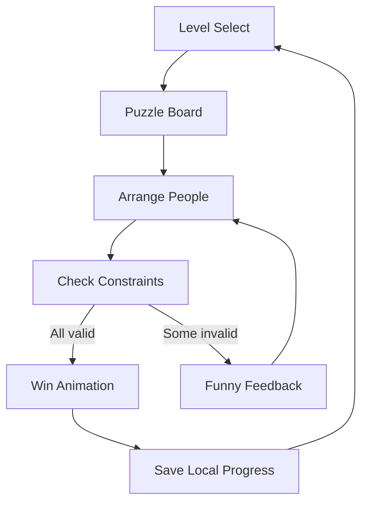

# Seating Puzzle Game Plan

## Product Vision
Create a funny, polished web puzzle game about arranging people into seats based on personality constraints. The bus/window/seat layout is only the visual representation; the real game is constraint-solving with characters who have preferences such as “I love the middle,” “don’t seat me next to Person 3,” or “I want the window.”

## Recommended Stack
- Use `Vite + React + TypeScript` for a fast, simple web game foundation.
- Use `Framer Motion` for drag/drop polish, character reactions, level transitions, and constraint feedback.
- Use `React Three Fiber` only for the fun presentation layer: animated bus, characters, celebration scene, or level intro/outro.
- Use local storage for progress, unlocked levels, settings, and completed scores.
- Keep the game logic independent from UI so levels can be tested and expanded easily.

## Core Gameplay Loop
1. Player opens a level and sees seats plus draggable characters.
2. Each character has visible constraint cards, tooltips, or funny dialogue hints.
3. Player drags people into seats.
4. The game evaluates the arrangement live or when the player presses `Check`.
5. Valid constraints glow green; failed constraints show clear, funny feedback.
6. When all constraints pass, the level completes with animation, score, and unlocks the next level.



## Game Model
Planned files:
- [`src/game/types.ts`](src/game/types.ts): shared types for `Person`, `Seat`, `Level`, `Constraint`, and `Arrangement`.
- [`src/game/constraints.ts`](src/game/constraints.ts): pure functions that evaluate constraints.
- [`src/game/levels.ts`](src/game/levels.ts): level definitions.
- [`src/game/solver.ts`](src/game/solver.ts): optional helper to validate level solvability during development.

Example level structure:
```ts
{
  id: "level-1",
  title: "The Window Drama",
  seats: [
    { id: "left", tags: ["window"] },
    { id: "middle", tags: ["middle"] },
    { id: "right", tags: ["window"] }
  ],
  people: [
    { id: "p1", name: "Mido", personality: "Loves the middle seat" },
    { id: "p2", name: "Nora", personality: "Needs a window" },
    { id: "p3", name: "Zed", personality: "Personal space champion" }
  ],
  constraints: [
    { type: "seatTag", personId: "p1", tag: "middle" },
    { type: "notAdjacent", personId: "p2", otherPersonId: "p3" },
    { type: "seatTag", personId: "p2", tag: "window" }
  ]
}
```

## Constraint Types For V1
- `seatTag`: person must sit in a seat with a tag like `window`, `middle`, `front`, or `back`.
- `notSeatTag`: person must avoid a seat tag.
- `adjacentTo`: person must sit next to another person.
- `notAdjacentTo`: person must not sit next to another person.
- `leftOf` / `rightOf`: person must be positioned relative to someone else.
- `exactSeat`: person must sit in a specific seat for tutorial levels.
- `groupTogether`: multiple people must be in neighboring seats.
- `separatedFromGroup`: person must not sit beside any member of a group.

## Level Progression
- Tutorial levels introduce one rule at a time.
- Early levels use 3 seats and 3 people.
- Mid levels use 4-6 seats, mixed positive and negative constraints.
- Later levels add rows, bus sections, VIP seats, front/back preferences, and funny personality combinations.
- Each level should have exactly one intended solution at first, or clearly support multiple valid solutions if designed that way.

Suggested first 10 levels:
1. Middle Lover: one person wants the middle.
2. Window Fan: one person wants a window.
3. No Neighbors: two people cannot sit together.
4. Best Friends: two people must sit together.
5. Left Side Energy: one person must be left of another.
6. Drama Triangle: one must be middle, two must be separated.
7. Double Window Trouble: two people want windows, one refuses middle.
8. Group Chat: three friends must stay connected.
9. Quiet Zone: one person avoids a noisy group.
10. Bus Chaos: combines window, adjacency, and relative position rules.

## UX Direction
- Make characters expressive and funny: exaggerated faces, little speech bubbles, and short personality lines.
- Use drag-and-drop as the main interaction; also support click-to-select then click-seat for accessibility.
- Show constraints as readable cards, not math-like rules.
- Use immediate feedback without giving away the answer: “Nora is still hunting for a window,” “Zed says Person 2 is too close.”
- Add satisfying win moments: confetti, character cheering, bus horn, or seat wiggle.
- Keep the board visually simple so puzzles stay readable.

## Visual Design
- Main board: clean 2D seats, cartoon character tokens, bright readable UI.
- Theme: playful bus interior or waiting room, but do not let decoration hide puzzle state.
- Character art can start as simple colorful avatars with unique shapes and accessories.
- Three.js layer can show a miniature bus/room in the background or victory scene after solving.
- Use animation for delight, not core interaction complexity.

## App Screens
- [`src/App.tsx`](src/App.tsx): app shell and routing/state orchestration.
- [`src/screens/MainMenu.tsx`](src/screens/MainMenu.tsx): title, continue, level select.
- [`src/screens/LevelSelect.tsx`](src/screens/LevelSelect.tsx): level grid, locks, stars/completion state.
- [`src/screens/GameScreen.tsx`](src/screens/GameScreen.tsx): puzzle board, rules panel, controls.
- [`src/screens/WinScreen.tsx`](src/screens/WinScreen.tsx): completion summary and next level.

## Main Components
- [`src/components/PuzzleBoard.tsx`](src/components/PuzzleBoard.tsx): renders seats and handles arrangement state.
- [`src/components/SeatSlot.tsx`](src/components/SeatSlot.tsx): individual drop target.
- [`src/components/PersonToken.tsx`](src/components/PersonToken.tsx): draggable character.
- [`src/components/ConstraintCard.tsx`](src/components/ConstraintCard.tsx): readable rule display and validation state.
- [`src/components/FeedbackBubble.tsx`](src/components/FeedbackBubble.tsx): funny messages for failed rules.
- [`src/components/ThreeScene.tsx`](src/components/ThreeScene.tsx): optional animated bus/character scene.

## Implementation Phases
1. Project setup: create Vite React TypeScript app, add styling, animation, and local storage helpers.
2. Game engine: define level data, seat model, arrangement model, and pure constraint evaluators.
3. Basic playable board: render seats/people, support placing and swapping people.
4. Rule feedback: validate constraints, show pass/fail states, add `Check` and win detection.
5. Level system: level select, progress saving, unlock flow, restart level.
6. UX polish: animations, sounds, funny text, responsive layout, keyboard/click support.
7. Three.js fun layer: add non-blocking animated scene for atmosphere or win state.
8. Content pass: create 10-20 levels, verify each is solvable, tune difficulty.
9. Quality pass: test mobile/desktop, accessibility, edge cases, and level validation.
10. Release: build production bundle, deploy to static hosting like Vercel or Netlify.

## Testing Strategy
- Unit test constraint functions because they are the game’s source of truth.
- Add a dev-only solver or validator that checks every level has at least one solution.
- Manually test drag/drop, swapping, reset, completion, and local progress.
- Test responsive layouts on desktop, tablet, and phone.
- Ensure the Three.js layer never blocks the core puzzle if WebGL fails or performance is low.

## MVP Definition
The first shippable version should include:
- 10 levels.
- 3-6 seats per level.
- 5-7 reusable constraint types.
- Local level progress.
- Polished 2D drag/drop gameplay.
- Funny character names, reactions, and win animations.
- One lightweight Three.js scene for personality, not required for solving.

## Later Expansion Ideas
- Daily puzzle mode.
- Level editor for creating custom seating puzzles.
- Shareable puzzle codes.
- More themes: classroom, wedding table, spaceship, cinema, train.
- Characters with unlockable costumes.
- Hints system that explains one failed constraint at a time.
- Accounts and leaderboards if the game grows beyond local play.